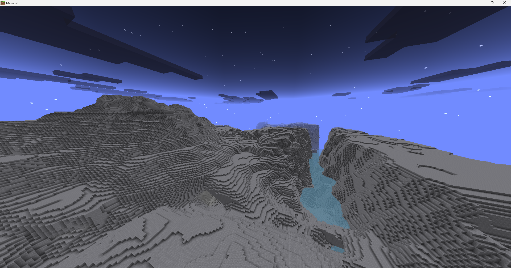
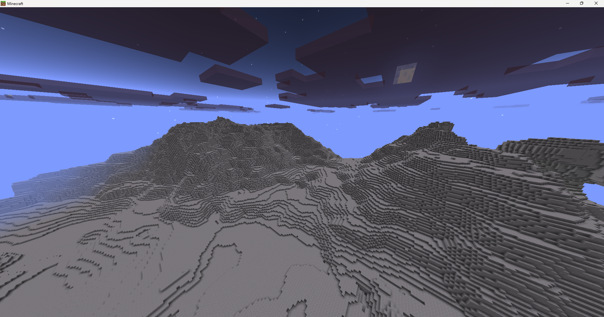
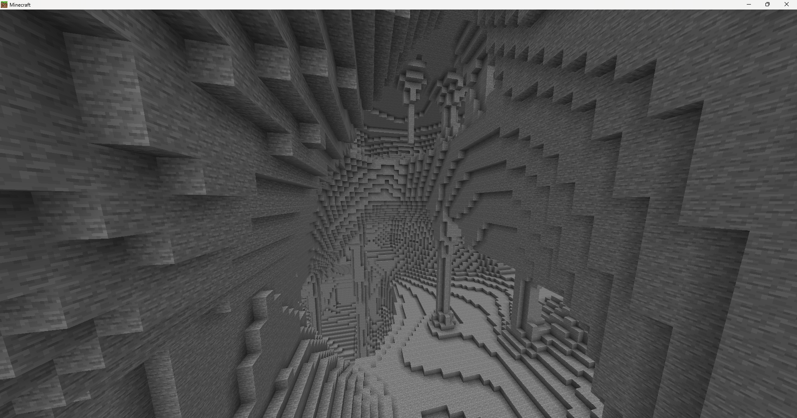
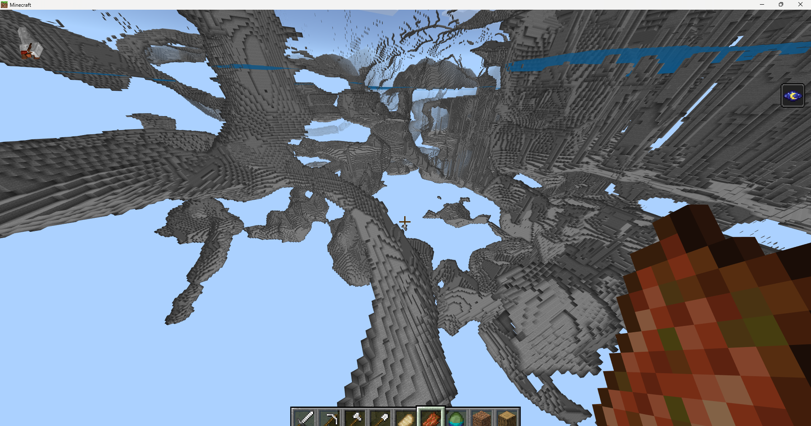

# VanillaOverworld

An experiment out of boredom, where I tried to port the world generator of PowerNukkitX/Vanilla Minecraft together with Deepseek and Claude Sonnet.

## Screenshots

Required PHP Extensions:

* GMP
* VoOverworld Noise Extension (Built by AI)
  
https://github.com/Lolfosjo/VanillaOverworld-Noises

* Xoroshiro (Small xoroshiro port, built by ai)
  
https://github.com/Lolfosjo/Xoroshiro-VanillaOverworld

> Note: This project was an experiment and is no longer actively developed. I won't be working on it further.
